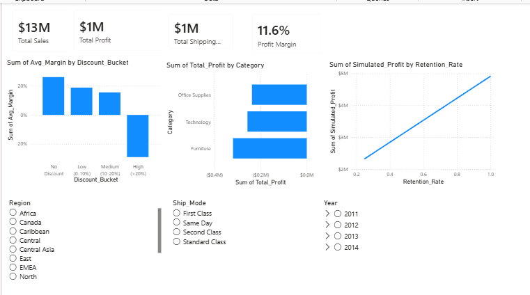
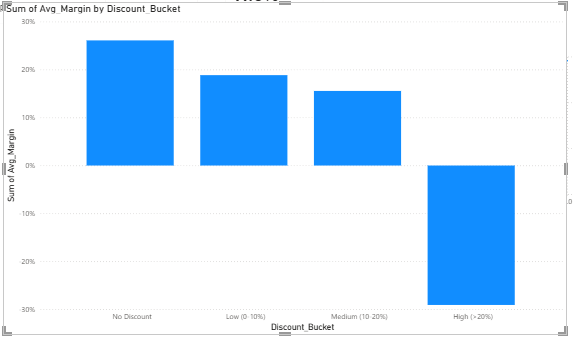
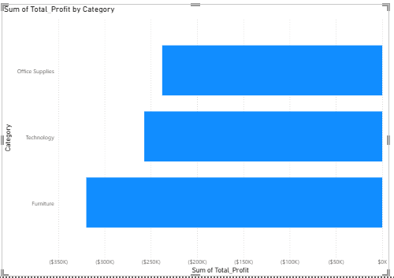
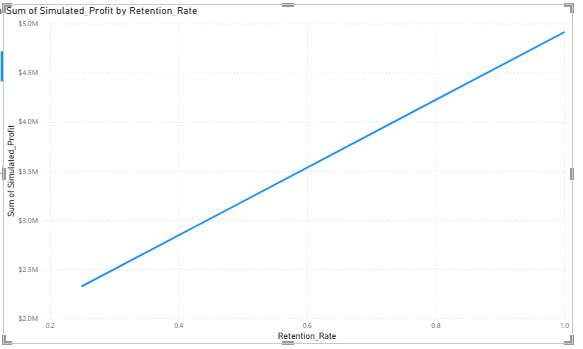

# Retail Profitability & Discount Policy Analysis

## Executive Summary

A retail business generated **~$13M in revenue but only ~$1M in profit**, indicating significant margin leakage.

This project investigates the drivers of profitability erosion and evaluates pricing policy changes that could improve margins.

Key findings show that **aggressive discounting is the primary driver of margin loss**, with discounts above **20% generating negative profit margins**. Simulation analysis suggests that reducing deep discounts could increase profit significantly if demand remains stable.

The analysis combines **SQL, Python, statistical modeling, and Power BI** to identify profit drivers and simulate policy scenarios.

---

# Business Problem

Despite strong revenue performance, the company’s profitability remained low. The key analytical questions were:

1. Which factors are driving low profitability?
2. How do discount policies affect profit margins?
3. Which product categories contribute most to losses?
4. What pricing strategy could improve profitability?

---

# Key Insights

### Shipping Costs Consume Most Profit

Total Shipping Cost ≈ **$1M**, nearly equal to total profit.

This indicates that logistics costs play a major role in margin erosion.

---

### Heavy Discounts Destroy Profitability

Orders with discounts above **20% generate negative margins**.

| Discount Bucket | Avg Margin |
|-----------------|------------|
| No Discount | ~26% |
| Low (0–10%) | ~18% |
| Medium (10–20%) | ~15% |
| High (>20%) | **-29%** |

---

### Category-Level Profitability

Furniture category drives most losses, while Technology and Office Supplies remain profitable.

---

### Pricing Policy Simulation

A simulation model tested profit sensitivity to discount reduction.

If deep discounts are limited:

Assumption: **customer demand remains constant**.

---

# Statistical Validation

A Pearson correlation test was used to evaluate the relationship between discount levels and profit margins.

Results:

- Correlation coefficient ≈ **-0.63**
- P-value < **0.001**

This indicates a strong and statistically significant negative relationship between discount levels and profitability.

In practical terms, **higher discounts are strongly associated with lower profit margins**.

---

# Regression Analysis

A linear regression model was used to quantify the impact of discount levels and shipping costs on profit margins.

Model:

Key findings:

- Discount levels have a **strong negative effect** on profit margins.
- Shipping costs have a smaller impact compared to discounting.
- The model confirms that **aggressive discounting is the primary driver of margin erosion**.

Note: Regression identifies statistical relationships but does not prove causation.

---

# Analytical Workflow

---

# Dashboard Overview

The dashboard enables decision-makers to explore:

- Profit drivers
- Discount behavior
- Category profitability
- Pricing policy scenarios
- Profit sensitivity to discount changes

---

# Discount vs Margin Analysis

High discounting (>20%) produces negative profit margins.

---

# Category Profitability

Furniture category contributes disproportionately to losses.

---

# Discount Policy Simulation

Reducing deep discounts significantly increases profit.

---

# Technologies Used

- Python
- Pandas
- SQL (SQLite)
- Statsmodels
- Scipy
- Power BI
- Jupyter Notebook

---

# Notebook Description

### 01_data_preparation_sql_analysis.ipynb

This notebook performs the core analytical workflow:

- Loading the retail dataset
- SQL-based aggregation using SQLite
- Order-level financial feature engineering
- Discount bucket segmentation
- Category-level profitability analysis
- Statistical testing
- Regression modeling
- Dataset preparation for dashboard visualization

---

# Repository Structure

---

# Business Recommendation

Limit discounts above **20%**, particularly in loss-making categories.

A pricing discipline policy could significantly improve profitability without requiring revenue growth.

---

# Skills Demonstrated

- Data Cleaning
- SQL Analytics
- Feature Engineering
- Profitability Modeling
- Statistical Testing
- Regression Modeling
- Scenario Simulation
- Business Intelligence Dashboarding
- Data Storytelling

